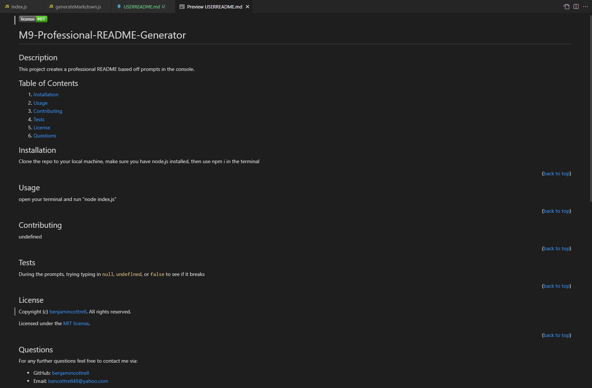

  

  # M9-Professional-README-Generator

  ## Description
  This project creates a professional README based off user input to prompts in the console. During this project I learned to:
  - Initialize a node project with `npm init -y`
  - Load a third-party module using `npm install` or `npm i`
  - Use inquirer to create a prompt for user input.
  - Use the fs core module to write a new file.
  - Reference a variable in a string while using template literal.

  ## Table of Contents
  
  1. [Installation](#installation)
  2. [Usage](#usage)
  3. [Contributing](#contributing)
  4. [Tests](#tests)
  5. [License](#license)
  6. [Questions](#questions)
  
  ## Installation
  
  1. Clone the repo to your local machine. 
  2. Make sure you have node.js installed. 
  3. Use npm i in the terminal to install the package.
  
(<a href="#readme-top">back to top</a>)

  ## Usage
  
  Open your terminal and run "node index.js" in the command line.
  
(<a href="#readme-top">back to top</a>)

  
  [Screencastify Video Demo](https://drive.google.com/file/d/1I2LmRxtOHU12Xyjtpva_jfd0vtq4QRwD/view)
  
  

  ## Contributing
  
  To contribute: 
  1. Fork the repo. 
  2. Make the changes you think would benefit this project
  3. Submit a pull request for review.
  
(<a href="#readme-top">back to top</a>)

  ## Tests
  
  During the prompts, trying typing in `null`, `undefined`, or `false` to see if it breaks
  
(<a href="#readme-top">back to top</a>)

  ## License
  Copyright (c) [benjamincottrell](https://github.com/benjamincottrell). All rights reserved. 
  
Licensed under the [MIT license](https://choosealicense.com/licenses/mit/).
  
(<a href="#readme-top">back to top</a>)

  ## Questions
  For any further questions feel free to contact me via:
  - GitHub: [benjamincottrell](https://github.com/benjamincottrell)
  - Email: [bencottrell48@yahoo.com](mailto:bencottrell48@yahoo.com)
  
(<a href="#readme-top">back to top</a>)

